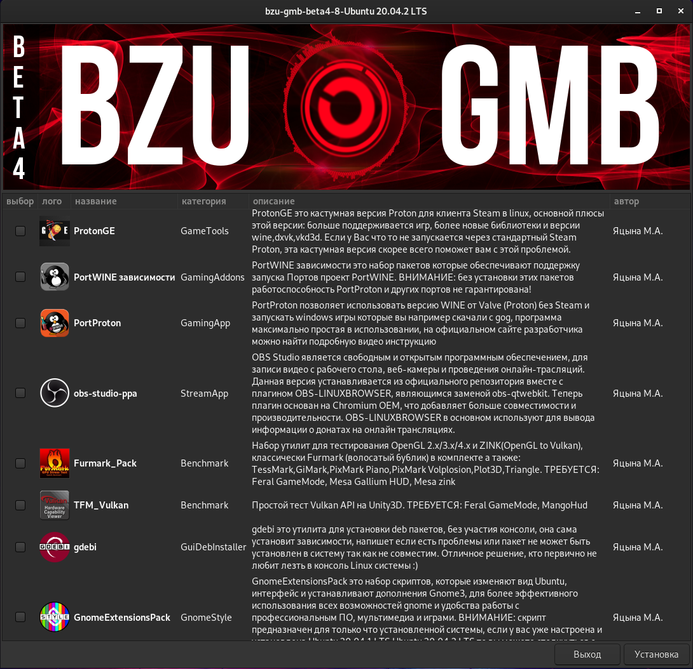

# bzu-gmb
bzu-gmb is auto-installer linux gaming tools,  development, graphic\video editors for Ubuntu\Linux Mint\Debian testing and other debian-based distributions in experimental mode, written in bash using zenity and yad libraries
-----------

Options
-----------
Ready modules : inxi, feralgamemode, mangohud-ppa, vkbasalt-ppa, goverlay-ppa, psensor-all, glances, cpu-x, xboxdrv, steam, proton-ge, lutris, port-proton-addons, port-proton, furmark-linux

Installation Gentoo:
-----------
cd; rm -rf bzu-gmb*; git clone https://github.com/Albert753258/bzu-gmb; cd ~/bzu-gmb; chmod +x mini_install.sh; bash mini_install.sh
